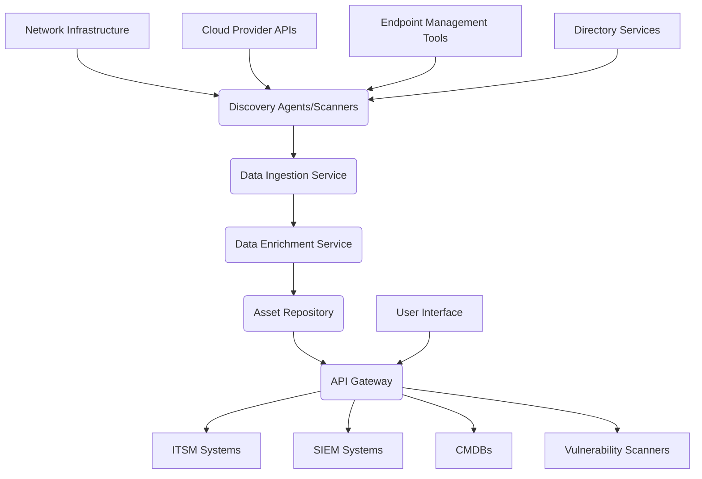
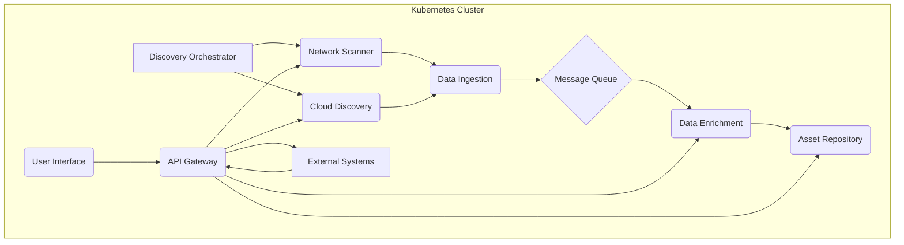

# System Architecture Document (SAD)
**Project:** test-fixed-discovery
**Version:** 1.0.0
**Date:** 2023-10-27
**Architect:** AI Architect

## 1. Executive Summary

The test-fixed-discovery project aims to establish a robust and scalable system for discovering and indexing fixed assets within an organization. This system will leverage a microservices architecture, employing modern cloud-native technologies to ensure high availability, performance, and maintainability. The core functionality will revolve around automated asset discovery, data enrichment, and a centralized repository for asset information. Key architectural decisions include the adoption of a polyglot persistence strategy, utilizing a combination of relational and NoSQL databases to optimize for different data types and access patterns. The technology stack will primarily consist of Rust for performance-critical services, Python for orchestration and data processing, and TypeScript for frontend development. Containerization using Docker and orchestration with Kubernetes will be fundamental for deployment and scaling. The system is designed to integrate seamlessly with existing IT infrastructure, providing a unified view of fixed assets and enabling efficient management and auditing.

The primary goal is to automate the often manual and error-prone process of fixed asset discovery, thereby reducing operational costs, improving accuracy, and enhancing compliance. This will be achieved through a phased approach, starting with core discovery mechanisms and progressively adding advanced features like anomaly detection and predictive maintenance insights. The architecture prioritizes modularity, allowing for independent development and deployment of services, which accelerates the delivery of new features and facilitates easier maintenance. The system will be designed with a strong emphasis on security, ensuring that sensitive asset data is protected throughout its lifecycle. The executive summary highlights the strategic importance of this project in modernizing asset management practices and providing a foundation for future enhancements in operational efficiency and data-driven decision-making.

## 2. Architecture Goals and Constraints

The architecture for test-fixed-discovery is driven by a set of critical quality attributes and business/technical constraints.

**Quality Attributes:**

*   **Performance:** The system must be able to discover and process a large volume of assets within defined timeframes.
    *   **Rationale:** Slow discovery and processing can lead to outdated asset information, impacting operational efficiency and decision-making.
    *   **KPI:** Asset discovery completion time for a network of 10,000 devices should be under 4 hours.
    *   **KPI:** Data ingestion rate for enriched asset data should exceed 1,000 records per second.
    *   **Example:** A critical server asset should be discoverable and its details updated within 15 minutes of a network change.

*   **Scalability:** The system must be able to scale horizontally to accommodate growth in the number of managed assets and users.
    *   **Rationale:** Organizations continuously grow, and the asset discovery system must adapt without requiring significant architectural redesign.
    *   **KPI:** The system should support a 50% increase in managed assets year-over-year without performance degradation.
    *   **KPI:** Concurrent user sessions for the asset management portal should scale to 500 without impacting response times.
    *   **Example:** During a company-wide hardware refresh, the system must handle the influx of new asset data and discovery requests without becoming a bottleneck.

*   **Availability:** The system must maintain a high level of uptime to ensure continuous access to asset information.
    *   **Rationale:** Asset information is crucial for IT operations, security, and financial reporting; downtime can have significant business consequences.
    *   **KPI:** Target availability of 99.95% for all core services.
    *   **KPI:** Mean Time To Recovery (MTTR) for critical failures should be less than 30 minutes.
    *   **Example:** The asset inventory portal must remain accessible 24/7, with scheduled maintenance windows minimized and communicated well in advance.

*   **Security:** The system must protect asset data from unauthorized access, modification, or disclosure.
    *   **Rationale:** Asset data can contain sensitive information about network topology, software versions, and hardware configurations, which are valuable targets for attackers.
    *   **KPI:** All data in transit and at rest must be encrypted using industry-standard algorithms (e.g., TLS 1.2+, AES-256).
    *   **KPI:** Successful penetration tests with zero critical vulnerabilities.
    *   **Example:** Access to the asset discovery configuration settings must be restricted to authorized administrators with multi-factor authentication.

*   **Maintainability:** The system should be easy to update, debug, and extend.
    *   **Rationale:** Reduces the total cost of ownership and allows for faster adaptation to evolving business needs.
    *   **KPI:** Code complexity metrics (e.g., Cyclomatic Complexity) for core services should remain below a predefined threshold (e.g., 10).
    *   **KPI:** Deployment time for a new service version should be under 10 minutes.
    *   **Example:** A bug fix for the network scanning module should be deployable within an hour of identification.

**Business Constraints:**

*   **Budget:** The project must be delivered within the allocated budget of $X million.
    *   **Rationale:** Financial discipline is a key requirement for all organizational projects.
    *   **Example:** Cloud infrastructure costs will be monitored closely, with optimization strategies implemented to stay within budget.

*   **Timeline:** The initial version of the system must be operational within 12 months.
    *   **Rationale:** The business requires a functional solution to address current asset management challenges promptly.
    *   **Example:** The core discovery and inventory features must be ready for pilot testing within 9 months.

*   **Integration:** The system must integrate with existing IT Service Management (ITSM) tools (e.g., ServiceNow) and security information and event management (SIEM) systems.
    *   **Rationale:** To avoid data silos and leverage existing investments in IT operations and security tooling.
    *   **Example:** Discovered asset data must be synchronized with ServiceNow's Configuration Management Database (CMDB).

**Technical Constraints:**

*   **Cloud-Native:** The system must be designed for deployment on a cloud platform (e.g., AWS, Azure, GCP).
    *   **Rationale:** To leverage cloud elasticity, managed services, and reduce on-premises infrastructure management overhead.
    *   **Example:** The system will utilize managed Kubernetes services for container orchestration.

*   **Open Source:** Preference for open-source technologies where feasible to reduce licensing costs and foster community support.
    *   **Rationale:** Cost-effectiveness and flexibility in technology choices.
    *   **Example:** Kubernetes, PostgreSQL, and Rust will be used as core open-source components.

*   **API-First Design:** All services must expose well-defined APIs for internal and external consumption.
    *   **Rationale:** Facilitates integration, automation, and future extensibility.
    *   **Example:** A RESTful API will be provided for querying asset information from the central repository.

## 3. System Context

The test-fixed-discovery system operates within a broader organizational IT ecosystem. It interacts with various internal systems and external entities to perform its functions. The primary goal is to automate the discovery, inventory, and enrichment of fixed assets across the organization's network and cloud environments.

The system will ingest data from network scanning tools, cloud provider APIs, and potentially endpoint agents. It will then process this data to identify and catalog hardware, software, and cloud resources. The enriched asset data will be stored in a central repository, making it accessible to other internal systems such as IT Service Management (ITSM) platforms, Security Information and Event Management (SIEM) systems, and asset lifecycle management tools.

**External Systems:**

*   **Network Infrastructure:** Routers, switches, firewalls, and other network devices that the system will scan to discover connected assets.
*   **Cloud Provider APIs:** Interfaces provided by AWS, Azure, GCP, etc., to discover and retrieve information about cloud-based assets (e.g., virtual machines, databases, storage).
*   **Endpoint Management Tools:** Existing tools that manage endpoints (e.g., SCCM, Intune) which can provide detailed asset information.
*   **IT Service Management (ITSM) Systems:** Platforms like ServiceNow, Jira Service Management, which will consume asset data for incident management, change management, and CMDB population.
*   **Security Information and Event Management (SIEM) Systems:** Systems like Splunk, ELK Stack, which will receive asset context for security event correlation and analysis.
*   **Configuration Management Databases (CMDBs):** Central repositories of IT asset information, which the discovery system will populate and synchronize with.
*   **Directory Services:** Active Directory or LDAP, used for user authentication and potentially for discovering domain-joined assets.
*   **Vulnerability Scanners:** Tools that identify security vulnerabilities on assets, whose findings can be correlated with asset inventory.

**Internal Components (High-Level):**

*   **Discovery Agents/Scanners:** Modules responsible for actively probing the network or querying cloud APIs to identify assets.
*   **Data Ingestion Service:** Handles the reception and initial validation of data from various discovery sources.
*   **Data Enrichment Service:** Augments raw asset data with information from other sources (e.g., CMDB, threat intelligence feeds).
*   **Asset Repository:** A central database storing the comprehensive and enriched asset information.
*   **API Gateway:** Provides a unified entry point for external systems to access asset data and functionalities.
*   **User Interface (UI):** A web-based portal for administrators to configure discovery, view asset inventory, and manage the system.

The system's context diagram illustrates these interactions, showing the flow of information and the dependencies between test-fixed-discovery and its surrounding environment. The rationale for this context is to ensure that the system is designed to fit seamlessly into the existing operational landscape, maximizing its utility and minimizing disruption. By understanding these interactions, we can design interfaces and data formats that promote interoperability and data consistency across the organization's IT infrastructure.

## 4. Container Architecture

The test-fixed-discovery system will be deployed as a set of containerized microservices orchestrated by Kubernetes. This approach provides numerous benefits, including improved resource utilization, simplified deployment and scaling, and enhanced fault isolation. Each microservice will be packaged into its own Docker container, ensuring consistency across development, testing, and production environments. Kubernetes will manage the lifecycle of these containers, handling aspects like service discovery, load balancing, and automated rollouts and rollbacks.

The container architecture is designed to be modular and resilient. Key containers include:

*   **Discovery Orchestrator Container:** This container manages the overall discovery process, scheduling scans, distributing tasks to specialized discovery agents, and aggregating results. It will be written in Rust for high performance and concurrency.
    *   **Rationale:** Centralized control and efficient task management are crucial for large-scale discovery operations. Rust's performance characteristics are ideal for this high-throughput service.
    *   **Example:** This container might orchestrate parallel network scans across different subnets.

*   **Network Scanner Container(s):** Dedicated containers responsible for performing network scans (e.g., using Nmap or custom protocols like SNMP, WMI). These can be scaled independently based on the network size and scan frequency.
    *   **Rationale:** Isolating network scanning logic allows for specialized optimization and independent scaling.
    *   **Example:** Multiple instances of this container can run concurrently to scan different network segments, reducing overall scan time.

*   **Cloud Discovery Container(s):** Containers that interact with cloud provider APIs (AWS SDK, Azure SDK, GCP SDK) to discover cloud resources.
    *   **Rationale:** Cloud environments have unique discovery mechanisms, necessitating dedicated services.
    *   **Example:** A container querying AWS EC2 API to list all running instances and their configurations.

*   **Data Ingestion Container:** A lightweight container responsible for receiving raw asset data from discovery containers and pushing it to a message queue for asynchronous processing.
    *   **Rationale:** Decoupling discovery from data processing improves resilience and allows for handling bursts of data.
    *   **Example:** This container receives scan results and publishes them to a Kafka topic.

*   **Data Enrichment Container(s):** Services that consume raw asset data from the message queue, enrich it with information from other sources (e.g., Active Directory, CMDB), and prepare it for storage.
    *   **Rationale:** Enrichment adds significant value to raw discovery data, providing context for better decision-making.
    *   **Example:** A container looking up user information in Active Directory for discovered workstations.

*   **Asset Repository Container:** This container hosts the primary database for storing all discovered and enriched asset information. It will likely be a managed database service or a self-hosted PostgreSQL instance.
    *   **Rationale:** A central, reliable data store is fundamental for providing a unified view of assets.
    *   **Example:** This container runs a PostgreSQL instance storing details of all discovered servers, laptops, and software.

*   **API Gateway Container:** Acts as the single entry point for all external requests to the system, handling routing, authentication, and rate limiting.
    *   **Rationale:** Provides a consistent and secure interface to the microservices.
    *   **Example:** All requests from the ITSM system to query asset data will go through this gateway.

*   **User Interface (UI) Container:** Hosts the frontend application, typically a Single Page Application (SPA) built with TypeScript, which interacts with the API Gateway.
    *   **Rationale:** Provides a user-friendly interface for managing and visualizing asset data.
    *   **Example:** The UI container serves the React application that administrators use to configure discovery jobs.

*   **Message Queue Container (e.g., Kafka, RabbitMQ):** A critical component for asynchronous communication between services, enabling resilience and scalability.
    *   **Rationale:** Facilitates event-driven architecture, allowing services to operate independently and handle varying loads.
    *   **Example:** Used to buffer discovery results before they are processed by enrichment services.

The container architecture will leverage Kubernetes features like Deployments for managing stateless applications, StatefulSets for stateful applications (like databases), Services for network access, and Ingress for external access. Health checks and readiness probes will be configured for each container to ensure that Kubernetes can automatically restart or replace unhealthy instances. This containerized approach ensures that the system is portable, scalable, and resilient, aligning with modern cloud-native best practices.

## 5. Component Architecture

The test-fixed-discovery system is composed of several key components, each with distinct responsibilities and well-defined interfaces. This modular design promotes maintainability, testability, and allows for independent evolution of different system parts.

**Component Responsibilities:**

*   **Discovery Manager:**
    *   **Responsibility:** Orchestrates the entire discovery process. It schedules discovery jobs, manages discovery profiles (e.g., network ranges, cloud credentials), distributes tasks to specific discovery modules, and aggregates results. It also handles error reporting and retries.
    *   **Rationale:** Centralizes control over discovery operations, ensuring efficient utilization of resources and consistent execution.
    *   **Example:** The Discovery Manager initiates a scheduled scan of the corporate network every night at 2 AM, using a predefined set of credentials and scan profiles.

*   **Network Discovery Module:**
    *   **Responsibility:** Performs active scanning of the network to identify devices. This includes tasks like ARP scanning, port scanning, and protocol-specific queries (SNMP, WMI, SSH) to gather information about hardware, operating systems, and installed software.
    *   **Rationale:** Specialized for network-based discovery, allowing for optimized algorithms and protocols.
    *   **Example:** This module uses Nmap to scan a subnet for active hosts and then attempts to connect via SNMP to gather device details like serial numbers and manufacturer.

*   **Cloud Discovery Module:**
    *   **Responsibility:** Interacts with cloud provider APIs (e.g., AWS EC2 API, Azure Resource Manager) to discover and retrieve metadata about cloud resources such as virtual machines, databases, storage buckets, and serverless functions.
    *   **Rationale:** Tailored for the dynamic and API-driven nature of cloud environments.
    *   **Example:** This module queries the AWS API to list all EC2 instances, their instance types, AMIs, and associated tags.

*   **Data Ingestion Service:**
    *   **Responsibility:** Receives raw discovery data from the various discovery modules. It performs initial validation, de-duplication, and publishes the data to a message queue for asynchronous processing by downstream components.
    *   **Rationale:** Decouples the discovery process from data processing, enabling resilience and scalability. It acts as a buffer for high-volume data streams.
    *   **Example:** Receives JSON payloads from Network and Cloud Discovery modules and publishes them as messages to a Kafka topic named `raw_asset_data`.

*   **Data Enrichment Service:**
    *   **Responsibility:** Consumes raw asset data from the message queue. It enriches this data by querying external sources like Active Directory (for user/group information associated with devices), CMDBs (for existing asset records), and potentially threat intelligence feeds. It then formats the enriched data for storage.
    *   **Rationale:** Adds crucial context to raw discovery data, making it more valuable for operational and security analysis.
    *   **Example:** Takes a discovered server's IP address, queries Active Directory to find its owner and department, and then queries the CMDB to check if it's already registered.

*   **Asset Repository Service:**
    *   **Responsibility:** Manages the central database where all discovered and enriched asset information is stored. It provides CRUD (Create, Read, Update, Delete) operations for asset data and supports complex queries.
    *   **Rationale:** Serves as the single source of truth for all asset information within the organization.
    *   **Example:** Stores detailed records for each asset, including hostname, IP address, MAC address, serial number, operating system, installed software, owner, and last discovered timestamp.

*   **API Gateway:**
    *   **Responsibility:** Acts as the single entry point for all external requests to the system. It handles request routing to the appropriate internal services, authentication, authorization, rate limiting, and response aggregation.
    *   **Rationale:** Provides a unified, secure, and managed interface to the system's functionalities, abstracting the underlying microservice complexity.
    *   **Example:** Routes incoming GET requests for `/assets/{id}` to the Asset Repository Service after verifying the caller's API key.

*   **User Interface (UI) Backend:**
    *   **Responsibility:** Provides the API endpoints consumed by the frontend UI. It interacts with the API Gateway or directly with internal services to fetch and display asset data, manage discovery configurations, and present system status.
    *   **Rationale:** Separates frontend concerns from backend logic, allowing for independent development and deployment of the UI.
    *   **Example:** Exposes an endpoint `/api/v1/discovery-jobs` that the frontend uses to list, create, and update discovery jobs.

**Interface Definitions:**

*   **Discovery Modules to Data Ingestion:** Data is sent via gRPC or RESTful APIs, typically in a structured format like JSON or Protocol Buffers, containing discovered asset attributes.
    *   **Example:** `POST /ingest/raw_data` with a JSON payload: `{"asset_id": "...", "type": "server", "ip_address": "...", "os": "..."}`.

*   **Data Ingestion to Message Queue:** Asynchronous publishing of messages to Kafka/RabbitMQ.
    *   **Example:** Publishing a message to `raw_asset_data` topic with the same JSON payload.

*   **Data Enrichment to External Sources:** Uses specific SDKs or APIs (e.g., LDAP libraries, SQL connectors, HTTP clients for CMDB APIs).
    *   **Example:** `ldapsearch -x -H ldap://dc.example.com -b "ou=users,dc=example,dc=com" "(sAMAccountName=jdoe)"`.

*   **Asset Repository Service:** Exposes a RESTful API for CRUD operations on assets.
    *   **Example:** `GET /api/v1/assets?os=Windows` to retrieve all Windows assets. `POST /api/v1/assets` to create a new asset record.

*   **API Gateway to Internal Services:** Typically uses RESTful APIs or gRPC for internal communication.
    *   **Example:** `GET /internal/assets/{id}` to fetch an asset by its unique identifier.

*   **UI Backend to API Gateway:** RESTful APIs.
    *   **Example:** `GET /api/v1/discovery-jobs` to retrieve a list of configured discovery jobs.

**Dependency Relationships:**

*   Discovery Manager depends on Network Discovery Module and Cloud Discovery Module to initiate scans.
*   Network Discovery Module and Cloud Discovery Module depend on the Discovery Manager for configuration and task assignment.
*   All Discovery Modules depend on the Data Ingestion Service to submit their findings.
*   Data Ingestion Service depends on the Message Queue.
*   Data Enrichment Service depends on the Message Queue and various external data sources (AD, CMDB).
*   Asset Repository Service is the primary data store, depended upon by the Data Enrichment Service (for updates) and the API Gateway/UI Backend (for reads).
*   API Gateway depends on all internal services it routes requests to.
*   UI Backend depends on the API Gateway.

This component architecture ensures a clear separation of concerns, making the system easier to understand, develop, and maintain. The use of message queues and APIs as interfaces promotes loose coupling, allowing components to be updated or replaced with minimal impact on other parts of the system.

## 6. Deployment Architecture

The test-fixed-discovery system will be deployed on a cloud-native infrastructure, leveraging Kubernetes for container orchestration. This approach ensures scalability, resilience, and efficient resource management. The deployment architecture is designed to support multiple environments, from development and staging to production.

**Infrastructure Components:**

*   **Kubernetes Cluster:** A managed Kubernetes service (e.g., Amazon EKS, Azure AKS, Google GKE) will be used to host and manage all application containers. This provides automated scaling, self-healing, and simplified deployment.
    *   **Rationale:** Kubernetes is the de facto standard for container orchestration, offering robust features for managing complex microservice deployments.
    *   **Example:** A production Kubernetes cluster with multiple worker nodes spread across different availability zones for high availability.

*   **Managed Database Services:** For the Asset Repository, a managed relational database service (e.g., AWS RDS for PostgreSQL, Azure Database for PostgreSQL) will be utilized.
    *   **Rationale:** Offloads the operational burden of database management, including patching, backups, and scaling, while ensuring high availability and durability.
    *   **Example:** An AWS RDS instance configured for PostgreSQL with multi-AZ deployment for automatic failover.

*   **Managed Message Queue Service:** A managed Kafka or RabbitMQ service (e.g., AWS MSK, Azure Event Hubs) will be used for asynchronous communication between microservices.
    *   **Rationale:** Provides a reliable and scalable messaging backbone without the overhead of managing message broker infrastructure.
    *   **Example:** An AWS MSK cluster for high-throughput, fault-tolerant message streaming.

*   **Object Storage:** Cloud object storage (e.g., AWS S3, Azure Blob Storage) will be used for storing discovery logs, configuration backups, and potentially large asset data exports.
    *   **Rationale:** Cost-effective, highly durable, and scalable storage for unstructured data.
    *   **Example:** S3 buckets configured with lifecycle policies for automatic data archiving.

*   **Container Registry:** A private container registry (e.g., AWS ECR, Azure Container Registry) will store Docker images for all microservices.
    *   **Rationale:** Secure and efficient storage and distribution of container images.
    *   **Example:** ECR repository for storing `discovery-orchestrator`, `network-scanner`, and other service images.

*   **Networking Components:**
    *   **Load Balancers:** Cloud provider load balancers will distribute incoming traffic to the API Gateway and User Interface services.
    *   **Ingress Controller:** Within Kubernetes, an Ingress controller (e.g., Nginx Ingress) will manage external access to services.
    *   **VPC/VNet:** Virtual Private Cloud or Virtual Network will provide network isolation for the Kubernetes cluster and associated services.
    *   **Security Groups/Network Policies:** To control network traffic flow between services and from external sources.
    *   **Rationale:** Essential for secure, reliable, and scalable network access to the application.
    *   **Example:** An AWS Application Load Balancer directing traffic to the Kubernetes Ingress controller, which then routes requests to the UI service.

**Deployment Environments:**

*   **Development:** A local or cloud-based environment for developers to build and test individual services. This might use Docker Compose or a small Kubernetes cluster.
    *   **Rationale:** Enables rapid iteration and testing of code changes.
    *   **Example:** Developers run services locally using Docker Desktop and connect to a shared development Kubernetes cluster.

*   **Staging/Pre-production:** A production-like environment used for integration testing, performance testing, and user acceptance testing (UAT).
    *   **Rationale:** Validates the system's behavior and performance in an environment that closely mirrors production before deployment.
    *   **Example:** A dedicated Kubernetes cluster with configurations and data volumes similar to production, used by QA and business stakeholders for testing.

*   **Production:** The live environment where the system serves end-users and performs its core functions. This environment will be highly available and monitored.
    *   **Rationale:** The ultimate goal, requiring robust infrastructure and operational practices.
    *   **Example:** The main Kubernetes cluster, managed database, and message queue services running in a production region with redundancy.

**Scaling Strategies:**

*   **Horizontal Pod Autoscaling (HPA):** Kubernetes HPA will automatically scale the number of pods for stateless services (e.g., Discovery Orchestrator, Data Ingestion, Data Enrichment, API Gateway) based on CPU utilization or custom metrics.
    *   **Rationale:** Dynamically adjusts compute resources to meet fluctuating demand, ensuring performance and cost-efficiency.
    *   **Example:** If the CPU utilization of the Data Enrichment service pods exceeds 70%, HPA will automatically increase the number of pods to handle the load.

*   **Cluster Autoscaler:** The Kubernetes cluster itself can be configured to automatically add or remove worker nodes based on the resource requests of pending pods.
    *   **Rationale:** Ensures that there are always enough nodes to run the required pods, and scales down during periods of low demand to save costs.
    *   **Example:** If new pods are scheduled but there are no available nodes with sufficient resources, the Cluster Autoscaler will provision new nodes.

*   **Database Scaling:** Managed database services offer options for read replicas to scale read operations and vertical scaling (increasing instance size) for overall capacity.
    *   **Rationale:** Ensures the database can handle the load from data ingestion and querying.
    *   **Example:** Adding read replicas to the PostgreSQL instance to offload read traffic from the primary instance.

*   **Message Queue Scaling:** Managed message queue services typically offer auto-scaling capabilities for partitions or brokers.
    *   **Rationale:** Maintains throughput and low latency as message volume increases.
    *   **Example:** Kafka cluster automatically scales by adding more brokers as the number of topics and partitions grows.

*   **Manual Scaling:** For certain components, like the Asset Repository Service (if not using a fully managed solution) or specific discovery agents, manual scaling might be employed based on long-term projections or specific operational needs.
    *   **Rationale:** Provides control for components that may not have predictable scaling patterns or require specific configurations.
    *   **Example:** Manually increasing the storage capacity of the PostgreSQL instance before a large data migration.

The deployment architecture emphasizes automation, resilience, and scalability, ensuring that the test-fixed-discovery system can reliably serve the organization's needs now and in the future.

## 7. Security Architecture

Security is a paramount concern for the test-fixed-discovery system, given the sensitive nature of asset inventory data. The security architecture is designed to protect the system and its data from unauthorized access, modification, and disclosure throughout its lifecycle. This involves a multi-layered approach encompassing authentication, authorization, data protection, and network security.

**Authentication and Authorization:**

*   **User Authentication:**
    *   **Mechanism:** Integration with the organization's Identity Provider (IdP) via SAML 2.0 or OpenID Connect. This allows users to authenticate using their existing corporate credentials. Multi-factor authentication (MFA) will be enforced at the IdP level.
    *   **Rationale:** Leverages existing, robust authentication mechanisms, reduces the burden of managing separate user credentials, and enforces strong authentication policies.
    *   **Example:** A user logs into the asset management portal using their corporate SSO credentials, which are validated by Azure AD.

*   **Service-to-Service Authentication:**
    *   **Mechanism:** Mutual TLS (mTLS) will be used for authentication between microservices within the Kubernetes cluster. Alternatively, API keys or JWTs issued by an internal identity service can be used.
    *   **Rationale:** Ensures that only trusted services can communicate with each other, preventing unauthorized internal access.
    *   **Example:** The Data Enrichment Service presents a client certificate to the Asset Repository Service to prove its identity before making a data write request.

*   **API Key Management:**
    *   **Mechanism:** External systems integrating with the API Gateway will use API keys. These keys will be securely generated, stored, and managed, with mechanisms for rotation and revocation.
    *   **Rationale:** Provides a secure and manageable way for external applications to authenticate and authorize access to the system's APIs.
    *   **Example:** The ITSM system is issued an API key with specific read-only permissions to query asset data.

*   **Role-Based Access Control (RBAC):**
    *   **Mechanism:** Within the application, roles will be defined (e.g., Administrator, Auditor, Viewer). Permissions will be assigned to these roles, and users will be granted roles based on their responsibilities. Kubernetes RBAC will also be used to control access to cluster resources.
    *   **Rationale:** Implements the principle of least privilege, ensuring users and services only have access to the resources they need to perform their functions.
    *   **Example:** An 'Auditor' role can view all asset data but cannot modify or delete it, while an 'Administrator' role has full control.

**Data Protection:**

*   **Data Encryption in Transit:**
    *   **Mechanism:** All communication between services, and between users and the system, will be encrypted using TLS 1.2 or higher. This includes internal service-to-service communication and external API calls.
    *   **Rationale:** Prevents eavesdropping and man-in-the-middle attacks on data as it travels across networks.
    *   **Example:** All HTTP requests to the API Gateway and the UI are made over HTTPS.

*   **Data Encryption at Rest:**
    *   **Mechanism:** Data stored in the Asset Repository (e.g., PostgreSQL database) and object storage (e.g., S3 buckets) will be encrypted at rest using industry-standard algorithms (e.g., AES-256). Managed database services typically provide this functionality.
    *   **Rationale:** Protects data from unauthorized access if the underlying storage media is compromised.
    *   **Example:** AWS RDS automatically encrypts the PostgreSQL database files using AWS KMS.

*   **Data Masking and Anonymization:**
    *   **Mechanism:** For non-production environments (development, staging), sensitive data fields may be masked or anonymized to prevent exposure of production data.
    *   **Rationale:** Reduces the risk of data breaches in less secure environments.
    *   **Example:** In the staging environment, actual user names in asset ownership fields might be replaced with generic placeholders.

*   **Data Retention and Deletion Policies:**
    *   **Mechanism:** Define and enforce policies for how long asset data is retained and how it is securely deleted when no longer needed, in compliance with regulatory requirements.
    *   **Rationale:** Minimizes the attack surface by reducing the amount of sensitive data stored and ensures compliance with data privacy regulations.
    *   **Example:** Asset data older than 7 years is automatically archived to cold storage and then securely deleted.

**Network Security:**

*   **Network Segmentation:**
    *   **Mechanism:** Utilize Virtual Private Clouds (VPCs) or Virtual Networks (VNets) to isolate the system's infrastructure. Within Kubernetes, Network Policies will be used to restrict traffic flow between pods.
    *   **Rationale:** Limits the blast radius of a security breach by preventing lateral movement of attackers.
    *   **Example:** A Kubernetes Network Policy might only allow the Data Enrichment Service to communicate with the Asset Repository Service on its specific database port.

*   **Firewall Rules:**
    *   **Mechanism:** Strict firewall rules will be implemented at the cloud provider level and within Kubernetes to allow only necessary inbound and outbound traffic.
    *   **Rationale:** Enforces the principle of least privilege for network access.
    *   **Example:** Inbound traffic to the API Gateway is restricted to specific ports (e.g., 443 for HTTPS) from authorized IP ranges.

*   **Intrusion Detection and Prevention Systems (IDPS):**
    *   **Mechanism:** Leverage cloud provider security services or integrate with existing organizational IDPS solutions to monitor network traffic for malicious activity.
    *   **Rationale:** Provides real-time detection and alerting of potential security threats.
    *   **Example:** CloudTrail logs are monitored for suspicious API calls, or network traffic is analyzed for unusual patterns.

*   **Regular Security Audits and Vulnerability Scanning:**
    *   **Mechanism:** Conduct regular security audits, penetration testing, and automated vulnerability scanning of the application code and infrastructure.
    *   **Rationale:** Proactively identifies and addresses security weaknesses before they can be exploited.
    *   **Example:** A quarterly penetration test is performed on the public-facing APIs of the system.

By implementing these security measures, the test-fixed-discovery system aims to provide a secure and trustworthy platform for managing organizational assets.

## 8. Data Architecture

The data architecture for test-fixed-discovery is designed to efficiently store, manage, and retrieve diverse asset information, supporting both structured and semi-structured data. It emphasizes a polyglot persistence approach, utilizing different database technologies optimized for specific data types and access patterns.

**Data Models:**

The core data model revolves around the concept of an `Asset`. Each asset will have a unique identifier and a set of attributes that describe its properties.

*   **Core Asset Entity:**
    *   `asset_id` (UUID): Unique identifier for each asset.
    *   `asset_type` (Enum: Server, Workstation, NetworkDevice, CloudInstance, SoftwareLicense, etc.): Categorization of the asset.
    *   `name` (String): Hostname or primary identifier.
    *   `status` (Enum: Active, Inactive, Decommissioned, Unknown): Current operational status.
    *   `created_at` (Timestamp): When the asset was first discovered.
    *   `last_discovered_at` (Timestamp): When the asset was last seen.
    *   `owner_id` (String/UUID): Reference to the user or group owning the asset (linked to Directory Services).
    *   `location` (String): Physical or logical location.
    *   `department` (String): Department responsible for the asset.
    *   `discovery_source` (Enum: Network, Cloud, Agent): Origin of the discovery data.

*   **Attribute-Value Pairs (for flexible attributes):**
    *   A flexible schema will be used to store attributes that vary significantly between asset types or are discovered dynamically. This could be implemented using a JSONB column in PostgreSQL or a separate NoSQL store.
    *   **Rationale:** Accommodates the wide variety of attributes for different asset types (e.g., CPU cores for servers, OS version for workstations, instance type for cloud instances) without rigid schema constraints.
    *   **Example:** For a server asset, attributes might include `{"cpu_cores": 16, "ram_gb": 64, "disk_size_gb": 1024, "os": "Ubuntu 22.04"}`. For a cloud instance, `{"instance_type": "t3.medium", "ami_id": "ami-0abcdef1234567890"}`.

*   **Software Inventory:**
    *   A separate table or collection to store details about software installed on assets.
    *   `software_id` (UUID): Unique identifier for the software entry.
    *   `asset_id` (UUID): Foreign key linking to the asset.
    *   `software_name` (String): Name of the software.
    *   `version` (String): Software version.
    *   `publisher` (String): Software publisher.
    *   `install_date` (Timestamp): Date of installation.
    *   **Rationale:** Enables detailed tracking of software assets, crucial for licensing, security patching, and compliance.
    *   **Example:** An entry for `{"software_name": "Microsoft Office Professional Plus 2021", "version": "16.0.14326.20454", "publisher": "Microsoft Corporation", "install_date": "2023-01-15"}`.

*   **Network Connection Data:**
    *   Information about network connections between assets, potentially stored in a graph database or a dedicated table for complex relationship analysis.
    *   `connection_id` (UUID): Unique identifier for the connection.
    *   `source_asset_id` (UUID): Source asset.
    *   `destination_asset_id` (UUID): Destination asset.
    *   `protocol` (String): e.g., TCP, UDP.
    *   `port` (Integer): Destination port.
    *   `last_observed` (Timestamp): When the connection was last seen.
    *   **Rationale:** Useful for network security analysis, understanding dependencies, and troubleshooting connectivity issues.
    *   **Example:** A record indicating that `Server-A` (asset_id: abc) communicates with `Database-B` (asset_id: def) over TCP port 5432.

**Data Storage Technologies:**

*   **PostgreSQL (Relational Database):** Will be used as the primary datastore for the core asset entity and structured inventory data (e.g., software inventory). Its robust ACID compliance, support for JSONB, and extensibility make it suitable for managing the primary asset catalog.
    *   **Rationale:** Provides strong consistency, reliable transactions, and efficient querying for structured data. JSONB support allows for flexible attribute storage.
    *   **Example:** Storing all `Asset` and `SoftwareInventory` records in PostgreSQL tables.

*   **NoSQL Database (e.g., Elasticsearch, MongoDB):** May be used for specific use cases, such as storing large volumes of raw discovery logs for audit purposes, or for time-series data related to asset performance metrics if that feature is added later.
    *   **Rationale:** Offers schema flexibility and high scalability for specific data types that don't fit well into a relational model.
    *   **Example:** Storing raw network scan logs in Elasticsearch for detailed troubleshooting and auditing.

*   **Graph Database (e.g., Neo4j):** Considered for storing and querying complex relationships between assets, such as network dependencies or software component hierarchies.
    *   **Rationale:** Optimized for traversing and querying highly connected data, making it ideal for understanding intricate relationships.
    *   **Example:** Modeling dependencies between application servers, databases, and load balancers.

**Data Flow:**

1.  **Discovery:** Network scanners and cloud discovery modules gather raw asset data from various sources.
2.  **Ingestion:** Raw data is sent to the Data Ingestion Service, which validates and publishes it to a message queue (e.g., Kafka).
3.  **Enrichment:** The Data Enrichment Service consumes raw data from the message queue. It queries external sources (e.g., Active Directory, CMDB) to gather additional context.
4.  **Storage:** The enriched asset data is then written to the Asset Repository Service, which persists it in PostgreSQL. For specific data types (e.g., raw logs), it might be sent to a NoSQL store.
5.  **Querying:** The API Gateway and UI Backend Service query the Asset Repository Service (and potentially other data stores) to retrieve asset information.
6.  **Integration:** External systems (ITSM, SIEM) access asset data via the API Gateway.

**Data Governance:**

*   **Data Ownership:** Clear ownership will be assigned for different data domains (e.g., IT Operations owns server data, Security owns vulnerability data).
*   **Data Quality:** Processes will be established to monitor and improve data quality, including validation rules, anomaly detection, and regular data cleansing activities.
    *   **Rationale:** Ensures the accuracy and reliability of asset information, which is critical for decision-making.
    *   **Example:** Implementing automated checks to identify duplicate asset entries or assets with missing critical attributes.
*   **Data Lineage:** Mechanisms will be put in place to track the origin and transformations of data, from discovery to its final state in the repository.
    *   **Rationale:** Provides transparency and auditability of data, essential for compliance and troubleshooting.
    *   **Example:** Logging the source of each attribute for an asset, including the discovery tool and enrichment steps.
*   **Data Security and Access Control:** As detailed in the Security Architecture section, strict access controls and encryption will be applied to protect data at rest and in transit.
*   **Data Retention Policies:** Defined policies for data lifecycle management, including archiving and secure deletion, will be enforced.

This data architecture provides a flexible, scalable, and secure foundation for managing the organization's fixed assets, enabling better visibility, control, and operational efficiency.